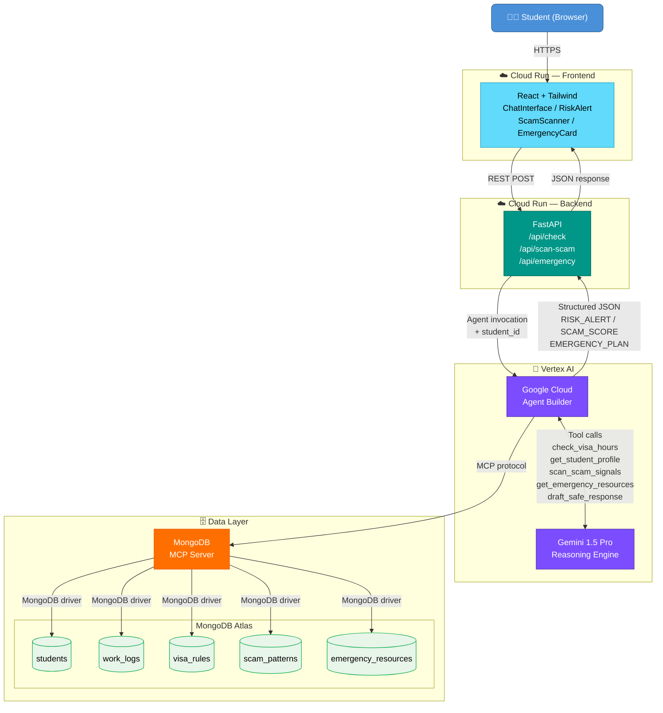

# GuardianVisa — System Architecture

High-level view of how the React frontend, FastAPI backend, Vertex AI Agent Builder, Gemini 1.5 Pro, MongoDB MCP Server, and MongoDB Atlas connect to protect international students.

## Key Insights

| Layer | Technology | Role |
|-------|-----------|------|
| **Frontend** | React + Tailwind on Cloud Run | Renders 3 specialised UI components (RiskAlert, ScamScanner, EmergencyCard) and posts to FastAPI |
| **Backend** | FastAPI on Cloud Run | Thin orchestration layer — validates input, calls Agent Builder, returns structured JSON |
| **Agent Brain** | Vertex AI Agent Builder | Manages tool-call loop; decides which tools to invoke and in what order |
| **Reasoning** | Gemini 1.5 Pro | Performs all LLM reasoning: intent detection, violation maths, scam scoring, plan drafting |
| **Data Gateway** | MongoDB MCP Server | Translates agent tool calls into MongoDB Atlas queries; acts as the secure data bridge |
| **Persistence** | MongoDB Atlas | Five collections store students, logs, rules, scam patterns, and emergency resources |

> The MCP Server is the **only** component with direct database credentials, keeping Gemini and Agent Builder stateless and credentials-free.
