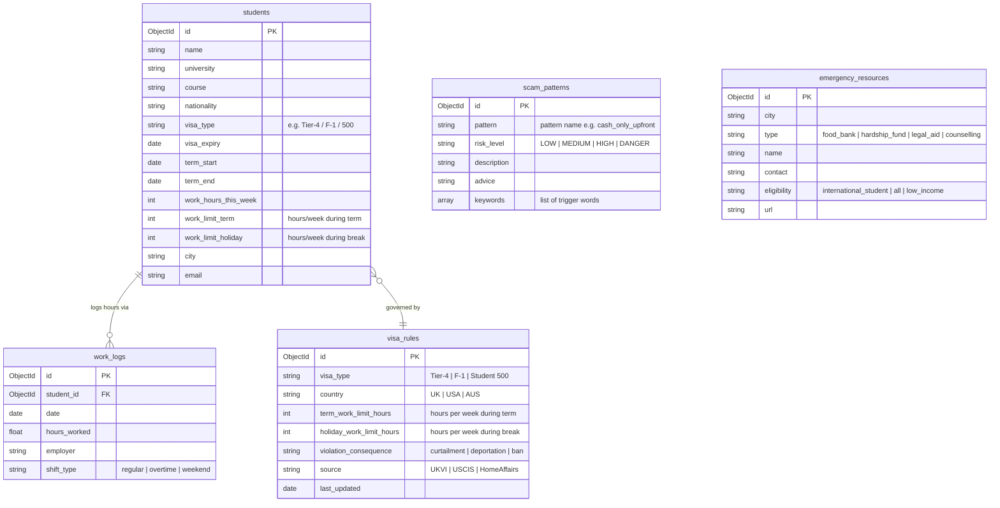

# GuardianVisa — MongoDB Entity-Relationship Diagram

All five MongoDB Atlas collections and their fields, plus the relationships between them.

## Key Insights

- **`students`** is the central entity — it embeds denormalised work-limit fields (`work_limit_term`, `work_limit_holiday`) so the visa-hours check tool can run a single document read without a join.
- **`work_logs`** uses `student_id` as a foreign key. The MCP tool `check_visa_hours()` aggregates this week's hours with `$sum` and compares against the limit.
- **`visa_rules`** is a lookup table keyed on `visa_type + country`, keeping rule updates independent of student records — critical when UK UKVI or US USCIS changes regulations.
- **`scam_patterns`** stores the `keywords[]` array so the MCP query can use MongoDB `$in` against tokenised listing text, enabling fast pattern matching without full-text search overhead.
- **`emergency_resources`** is geographically scoped by `city`, so `get_emergency_resources(city)` returns only locally relevant services for the student's location.
- No explicit relationship exists between `scam_patterns`/`emergency_resources` and `students` — these are read-only reference collections queried by agent tools, not linked by FK.
