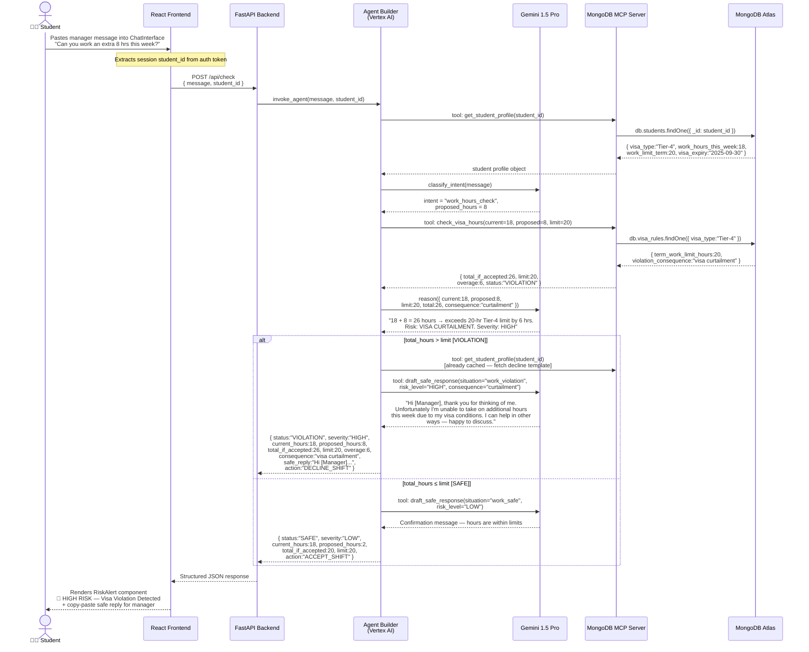

# GuardianVisa — Flow 1: Visa Work-Hour Violation Check

Step-by-step sequence when a student pastes a manager's message asking them to work extra hours.

## Key Insights

| Step | What Happens | Why It Matters |
|------|-------------|----------------|
| **Profile fetch** | Agent retrieves `work_hours_this_week` and `work_limit_term` in one MCP call | Eliminates need for client to send sensitive visa data in every request |
| **Intent classification** | Gemini extracts `proposed_hours = 8` from natural-language text | Handles informal phrasing like "a couple of extra shifts" |
| **Hour arithmetic** | MCP tool performs `current + proposed vs limit` deterministically | Keeps critical business logic out of the LLM; Gemini only reasons about consequences |
| **`alt` block** | Two branches: VIOLATION (total > limit) and SAFE (total ≤ limit) | The UI renders a red `RiskAlert` for violations, green confirmation for safe scenarios |
| **`draft_safe_response`** | Gemini generates a polite, legally-safe decline message | Student doesn't have to explain visa rules to their employer — the agent does it diplomatically |
| **Structured JSON** | Agent returns typed fields: `status`, `severity`, `overage`, `safe_reply` | Frontend components bind directly to fields without parsing free-form text |
