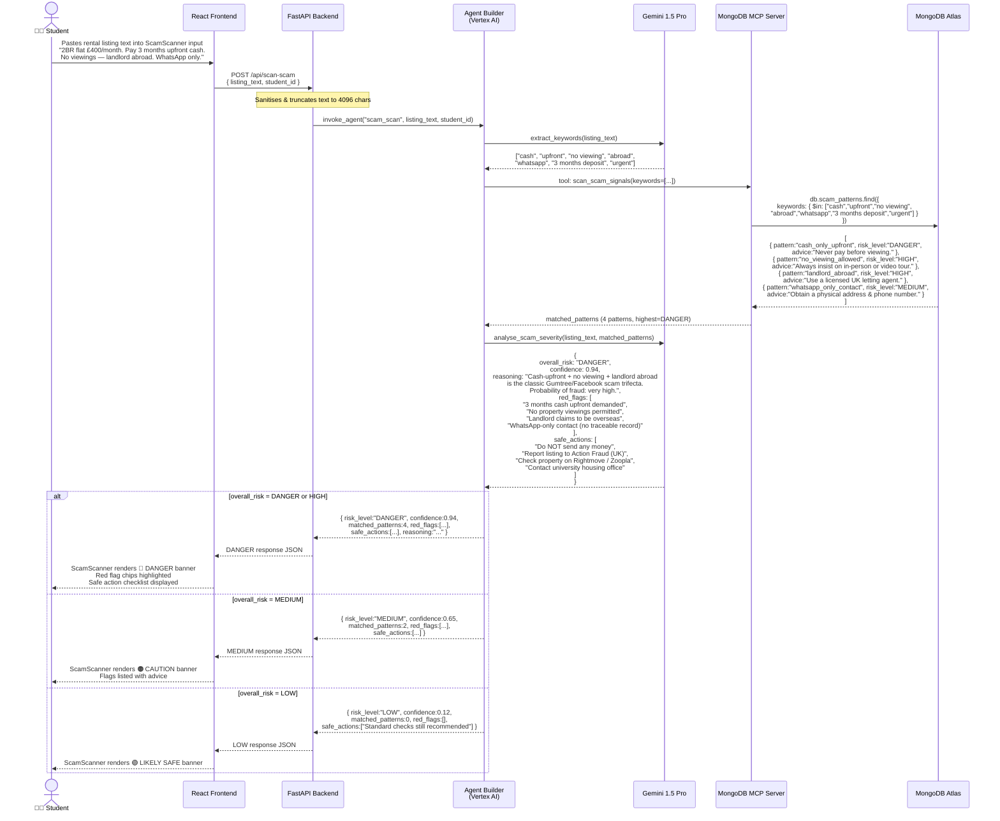

# GuardianVisa — Flow 2: Accommodation Scam Detection

Step-by-step sequence when a student pastes a rental listing to check for red flags.

## Key Insights

| Step | What Happens | Why It Matters |
|------|-------------|----------------|
| **Keyword extraction** | Gemini tokenises the listing before hitting MongoDB | Allows fuzzy natural-language input to map to structured pattern keys |
| **`$in` query** | MongoDB MCP uses `$in` operator on the `keywords[]` array field | Fast index scan — no full-text search licence needed; sub-10ms at scale |
| **Pattern database** | `scam_patterns` stores community-curated red flags with severity levels | Non-AI rules can be updated independently of model deployment |
| **Confidence score** | Gemini returns 0–1 confidence alongside the risk label | Frontend can show uncertainty — "94% confident this is fraud" vs "65% caution" |
| **Four risk levels** | LOW / MEDIUM / HIGH / DANGER map to green / amber / red / red-pulsing UI | Graduated response prevents alarm fatigue for minor flag matches |
| **`safe_actions`** | Actionable next steps returned per listing | Transforms detection into student empowerment — not just a warning but a to-do list |
