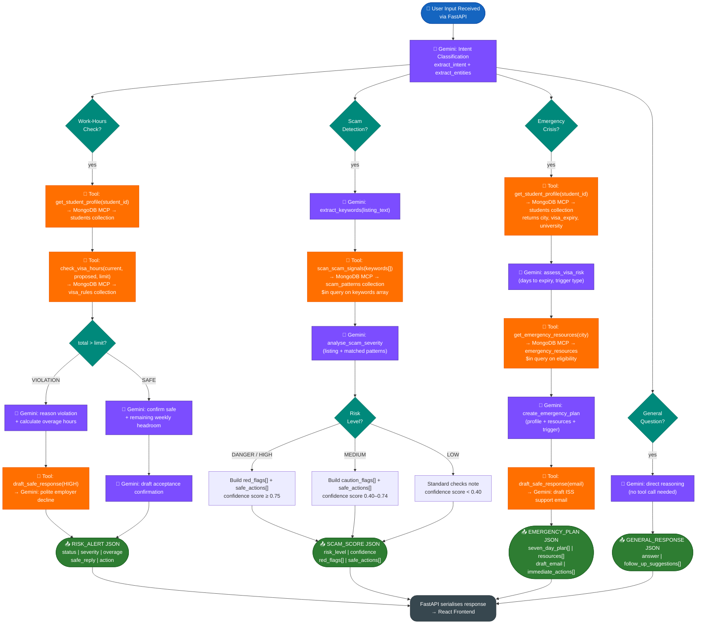

# GuardianVisa — Agent Internal Tool-Call Flow

How the Vertex AI Agent Builder routes user intent to the correct tool chain, queries MongoDB via MCP, and produces a structured response.

## Key Insights

| Component | Colour | Role |
|-----------|--------|------|
| **Purple nodes** | Gemini calls | All LLM reasoning is isolated to purple nodes — intent classification, severity analysis, plan generation, drafting |
| **Orange nodes** | Tool calls | All data access goes through MCP tool calls — keeps the agent stateless and database credentials out of the LLM |
| **Green decision diamonds** | Routing gates | Hard logical branches (total > limit?, risk level?) use deterministic rules, not LLM guesses |
| **Dark output nodes** | Typed JSON | Each flow produces a distinct, schema-validated JSON type — prevents frontend from handling ambiguous responses |
| **Flow 4 (no tools)** | Direct Gemini path | Simple visa FAQs skip MongoDB entirely — cost-efficient for common "what is Tier-4?" questions |

> **Design principle:** LLMs reason; tools fetch. The agent never asks Gemini to recall visa rules from training data — it always fetches authoritative values from MongoDB, then asks Gemini to reason about them.
