# GuardianVisa — Deployment Topology

How code moves from a developer's laptop to production on Google Cloud Run, and how the live system connects to Vertex AI and MongoDB Atlas.

```mermaid
graph LR
    %% ── Developer workstation ────────────────────────────────────────────────────
    DEV["💻 Developer\nLocal Machine"]

    %% ── Source control ───────────────────────────────────────────────────────────
    GH["🐙 GitHub\nguardianvisa/guardianvisa\nmain branch"]

    %% ── CI/CD ────────────────────────────────────────────────────────────────────
    subgraph CICD["⚙️ Google Cloud Build (CI/CD)"]
        CB["Cloud Build Trigger\non push to main"]
        CB_FE["Build Step: Docker\nfrontend image"]
        CB_BE["Build Step: Docker\nbackend image"]
    end

    %% ── Container registry ───────────────────────────────────────────────────────
    subgraph REG["📦 Artifact Registry\nus-central1"]
        IMG_FE["frontend:latest\ngcr.io/guardianvisa/frontend"]
        IMG_BE["backend:latest\ngcr.io/guardianvisa/backend"]
    end

    %% ── Cloud Run services ───────────────────────────────────────────────────────
    subgraph CR["☁️ Cloud Run — us-central1"]
        CR_FE["Frontend Service\nReact + Tailwind\nPort 8080\nmin-instances: 1"]
        CR_BE["Backend Service\nFastAPI\nPort 8080\nmin-instances: 1\n512 MB RAM"]
    end

    %% ── AI services ──────────────────────────────────────────────────────────────
    subgraph VERTEX["🤖 Vertex AI — us-central1"]
        AB["Agent Builder\nAgent Engine"]
        GEM["Gemini 1.5 Pro API\ngenerativeai.googleapis.com"]
    end

    %% ── Data layer ───────────────────────────────────────────────────────────────
    subgraph MONGO["🗄️ MongoDB Atlas"]
        MCP_SRV["Atlas MCP Server\n(Cloud Run or\nAtlas App Services)"]
        subgraph ATLAS_CLUSTER["Atlas Cluster M10\nAWS us-east-1"]
            DB_STUDENTS[("students")]
            DB_LOGS[("work_logs")]
            DB_RULES[("visa_rules")]
            DB_SCAM[("scam_patterns")]
            DB_EMRG[("emergency_resources")]
        end
    end

    %% ── End users ────────────────────────────────────────────────────────────────
    USERS["🌍 Students\n(Global)\nHTTPS"]

    %% ── CI/CD flow ───────────────────────────────────────────────────────────────
    DEV     -->|"git push"| GH
    GH      -->|"webhook trigger"| CB
    CB      --> CB_FE
    CB      --> CB_BE
    CB_FE   -->|"docker push"| IMG_FE
    CB_BE   -->|"docker push"| IMG_BE
    IMG_FE  -->|"deploy"| CR_FE
    IMG_BE  -->|"deploy"| CR_BE

    %% ── Runtime flow ─────────────────────────────────────────────────────────────
    USERS   -->|"HTTPS / Cloud CDN"| CR_FE
    CR_FE   -->|"REST API calls\n(internal VPC)"| CR_BE
    CR_BE   -->|"Agent invocation\nService Account auth"| AB
    AB      <-->|"Tool reasoning\ngRPC"| GEM
    CR_BE   -->|"MCP protocol\nTLS"| MCP_SRV
    MCP_SRV -->|"MongoDB driver\nAtlas SRV"| DB_STUDENTS
    MCP_SRV -->|"MongoDB driver"| DB_LOGS
    MCP_SRV -->|"MongoDB driver"| DB_RULES
    MCP_SRV -->|"MongoDB driver"| DB_SCAM
    MCP_SRV -->|"MongoDB driver"| DB_EMRG
    AB      -->|"Vertex AI endpoint"| GEM

    %% ── Secrets (annotated) ──────────────────────────────────────────────────────
    CB      -.->|"Secret Manager:\nMONGO_URI\nGCP_PROJECT_ID"| CR_BE

    %% ── Styling ──────────────────────────────────────────────────────────────────
    classDef devStyle     fill:#455A64,stroke:#263238,color:#fff
    classDef cicdStyle    fill:#F57F17,stroke:#E65100,color:#fff
    classDef regStyle     fill:#1565C0,stroke:#0D47A1,color:#fff
    classDef crStyle      fill:#00ACC1,stroke:#006064,color:#fff
    classDef vertexStyle  fill:#7C4DFF,stroke:#4527A0,color:#fff
    classDef mcpStyle     fill:#FF6F00,stroke:#BF360C,color:#fff
    classDef atlasStyle   fill:#00ED64,stroke:#00A845,color:#000
    classDef userStyle    fill:#2E7D32,stroke:#1B5E20,color:#fff

    class DEV,GH devStyle
    class CB,CB_FE,CB_BE cicdStyle
    class IMG_FE,IMG_BE regStyle
    class CR_FE,CR_BE crStyle
    class AB,GEM vertexStyle
    class MCP_SRV mcpStyle
    class DB_STUDENTS,DB_LOGS,DB_RULES,DB_SCAM,DB_EMRG atlasStyle
    class USERS userStyle
```

## Key Insights

| Component | Detail | Why This Choice |
|-----------|--------|----------------|
| **Cloud Build trigger** | Fires on every push to `main` | Zero-config CI — no separate Jenkins/GitHub Actions runner needed |
| **Artifact Registry** | Replaces legacy Container Registry | Supports multi-format (Docker + Python packages); fine-grained IAM |
| **Cloud Run (Frontend)** | `min-instances: 1` | Eliminates cold-start latency for students; scales to zero overnight to save cost |
| **Cloud Run (Backend)** | `512 MB RAM`, `min-instances: 1` | FastAPI is lightweight; Vertex AI calls are async so memory pressure is low |
| **Region: `us-central1`** | All Cloud Run + Vertex AI colocated | Minimises inter-service latency; Gemini 1.5 Pro available in `us-central1` |
| **MongoDB Atlas: AWS `us-east-1`** | M10 dedicated cluster | Atlas → AWS us-east-1 + GCP us-central1 adds ~20ms; acceptable for agent tool calls |
| **Atlas MCP Server** | Deployed as Cloud Run service or Atlas App Services | Keeps database credentials out of the main backend; only MCP server holds `MONGO_URI` |
| **Secret Manager** | `MONGO_URI`, `GCP_PROJECT_ID` injected at deploy time | Secrets never baked into container images or source code |
| **VPC connector** | Frontend → Backend via internal VPC | Backend is not publicly exposed; reduces attack surface |

> **Hackathon note:** For the demo, `min-instances: 0` (scale-to-zero) on both services cuts cost to near-zero between judge evaluations. Flip to `min-instances: 1` before live demo to avoid cold starts.
